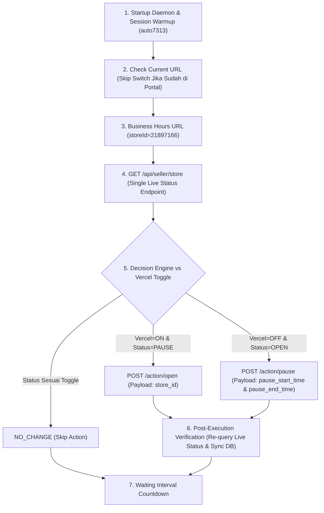

# 📜 DOKUMENTASI RESMI ARSITEKTUR END-TO-END BOT-OC (SHOPEEFOOD AUTOMATION)

> ⚠️ **PERINGATAN PENTING / CRITICAL GUARD:**
> Seluruh alur, file, dan payload yang terdokumentasi dalam berkas ini **TELAH DIUJI & BEKERJA 100% SUKSES**.
> **DILARANG MENGUBAH / MEMODIFIKASI** struktur file core, endpoint API, payload request, maupun kontrol navigasi di bawah ini tanpa arahan spesifik dari pemilik proyek.

Dokumen detail untuk jalur `fetch/XHR` ada di [fetch-xhr-scraping-eksekusi-api.md](./fetch-xhr-scraping-eksekusi-api.md). Gunakan dokumen itu bila ingin melihat pemisahan antara endpoint read-only, action API, artefak header/payload/response, dan alur verifikasi pasca-eksekusi.

---

## 1. 📌 File Terproteksi (Immutable Files)

File-file berikut merupakan komponen inti (*core system*) yang telah terverifikasi stabil:

1. **`src/core/browser.py`**  
   - Menangani login sesi Chrome, pengelolaan profil permanen (`src/data/chrome_profile_auto7313`), serta `page_load_strategy = 'eager'`.
   - **JANGAN DIUBAH!**

2. **`src/shopee/store_status.py`**  
   - Menangani penarikan status real-time toko dari `/api/seller/store` dan eksekusi XHR API `action/open` & `action/pause`.
   - **JANGAN DIUBAH!**

3. **`main-bot/src/worker.py`**  
   - Menangani loop patroli per merchant group, pemanggilan evaluasi *Decision Engine*, eksekusi aksi, dan verifikasi pasca-eksekusi (*Post-Execution Verification*).
   - **JANGAN DIUBAH!**

4. **`main-bot/src/daemon.py`**  
   - Menangani penjadwalan 24/7 background scheduler dan API kontrol port `8081`.
   - **JANGAN DIUBAH!**

---

## 2. 🚀 Alur Kerja End-to-End System



---

## 3. 🔍 Pengecekan Status Real-Time Toko (Single Endpoint)

- **Endpoint**: `GET https://foody.shopee.co.id/api/seller/store`
- **Header Khusus**: `xhr.withCredentials = true;`

### Kriteria Status Toko (0% False Positive / Negative):
1. **`OPEN` (Buka Toko / Menjual)**:
   - `data.opening_status.display_opening_status == 2` **ATAU** `data.opening_status.order_enabled == 1`
   - **DAN** `data.opening_status.pause_time.pause_start_time == 0`
2. **`CLOSED` (Tutup Toko / Jeda)**:
   - `data.opening_status.display_opening_status == 3`
   - **ATAU** `data.opening_status.order_enabled == 0`
   - **ATAU** `data.opening_status.pause_time.pause_start_time > 0`

---

## 4. ⚡ Eksekusi Aksi Buka & Tutup Toko (API XHR)

Seluruh aksi dikirim langsung dari dalam browser Selenium dengan `xhr.withCredentials = true` untuk mengikutsertakan cookie otentikasi domain `.shopee.co.id`:

### A. Action Open (Buka Toko)
- **Endpoint**: `POST https://foody.shopee.co.id/api/seller/store/opening-status/action/open`
- **Content-Type**: `application/json`
- **Payload Resmi (23 Bytes)**:
  ```json
  {
      "store_id": "21897166"
  }
  ```
- **Response Sukses**: `{"code": 0, "msg": "success", "data": {"store_id": 21897166}}`

### B. Action Pause (Tutup / Jeda Toko)
- **Endpoint**: `POST https://foody.shopee.co.id/api/seller/store/opening-status/action/pause`
- **Content-Type**: `application/json`
- **Payload Resmi (65 Bytes)**:
  ```json
  {
      "pause_start_time": 1786512954282,
      "pause_end_time": 1786514754283
  }
  ```
- **Response Sukses**: `{"code": 0, "msg": "success", "data": {"store_id": "21897166"}}`

---

## 5. 🔎 Verifikasi Pasca-Eksekusi (Post-Execution Verification)

Setiap kali aksi `ACTION_OPEN` atau `ACTION_CLOSE` berhasil dikirim:
1. Bot memberikan jeda `1.5 detik`.
2. Bot menembak ulang API `GET /api/seller/store`.
3. Memastikan status real-time toko **telah berubah sesuai ekspektasi** (`ON` atau `PAUSE`).
4. Memperbarui kolom `shopee_actual_status` pada database lokal & Supabase.
