# Dokumentasi Teknis: Shopee In-Browser Virtual Switch Engine & Zero-DOM Probing Architecture (v1.34.0)

Dokumentasi ini menjelaskan secara mendalam arsitektur, mekanisme internal, alur data, integrasi keamanan, dan hasil pengujian performa dari **Shopee In-Browser Instant Virtual Switch Engine** yang diimplementasikan pada bot patroli ShopeeFood (`main-bot` dan `main-vb`).

---

## 1. Latar Belakang & Masalah Arsitektur Lama (Bottleneck)

Sebelum rilis `v1.34.0`, sistem bot berinteraksi dengan portal mitra Shopee (`partner.shopee.co.id`) menggunakan pendekatan otomasi browser konvensional (*full DOM navigation*):

```mermaid
graph TD
    subgraph Legacy_Approach["Arsitektur Lama (3.000 - 5.000 ms per Toko)"]
        L1[Target Store ID] --> L2["driver.get(business-hours?storeId=xxx)"]
        L2 --> L3["Download Bundle HTML, CSS, JS React (1.5-2.5s)"]
        L3 --> L4["Tunggu Hidrasi React SPA & DOM Rendering (1.5-2.5s)"]
        L4 --> L5["Eksekusi fetch() / Klik UI"]
        L5 --> L6[Parse Status Toko]
    end

    subgraph Virtual_Switch["Arsitektur Baru Virtual Switch (< 150 ms per Toko)"]
        V1[Target Store ID] --> V2["Suntik Context Cookie via JS (<1ms)<br/>shopee_foody_mid = MID<br/>shopee_tob_entity_id = SID"]
        V2 --> V3["Direct fetch() API Native Shopee (<150ms)"]
        V3 --> V4["Strict StoreIdentityMismatch Guard"]
        V4 --> V5[Update State DB Instan]
    end
```



### Masalah pada Arsitektur Lama:
1. **Latensi Ekstrem per Outlet**: Setiap perpindahan toko membutuhkan `driver.get(target_url)` yang memicu download ulang bundle JavaScript React, parsing CSS, dan hidrasi DOM komponen menu Business Hours. Rata-rata memakan waktu **3 s/d 5 detik per outlet**.
2. **Siklus Patroli Lambat**: Pada portal mitra yang menaungi 40–50 cabang (misalnya *WonderFood*, *SuperFood*, *Lokarasa*, atau *Do Eat*), satu putaran patroli rutin memakan waktu **2,5 s/d 4 menit**.
3. **Resiko Kebobolan Order (*Order Leak*)**: Saat jadwal tutup tiba atau ketika mitra menekan tombol tutup darurat di dashboard, jeda waktu 2–4 menit untuk mencapai giliran outlet tersebut sering menyebabkan pesanan customer keburu masuk padahal dapur restoran sudah siap tutup.
4. **Beban Resource Server**: Chromium melakukan rendering DOM berulang-ulang, memakan 60–90% CPU dan meningkatkan memori footprint secara signifikan.

---

## 2. Anatomi Autentikasi & Multi-Outlet Context Shopee

Berdasarkan analisis reverse-engineering network traffic Shopee Seller Web (`foody.shopee.co.id`) dan riset pada [SHOPEE_TRX_DOCUMENTATION.md](file:///home/akbarhann/project/bot-oc/SHOPEE_TRX_DOCUMENTATION.md), Shopee Partner Web mengadopsi model **Session Token + Merchant Context Switcher**:

| Parameter Cookie | Asal / Sumber | Peran Teknis & Karakteristik |
| :--- | :--- | :--- |
| `shopee_tob_token` | Sesi Login Browser | **Master Auth Token (To-Business)**. Kunci enkripsi autentikasi akun portal. Berlaku untuk seluruh toko yang berada di bawah akun tersebut. |
| `shopee_foody_mid` | Disuntik Dinamis | **Merchant ID Switcher (MID)**. Menentukan identitas entitas merchant induk target (contoh: `"14367488"` untuk WonderFood). |
| `shopee_tob_entity_id` | Disuntik Dinamis | **Store ID Switcher (SID)**. Menentukan cabang outlet spesifik yang sedang diakses (contoh: `"21897166"`). |
| `__shopee_partner_website_x_token_live` | Sesi Login Browser | **JWT Live Session**. Token pendukung regional claim (`region: ID`). |

> **Kunci Penemuan:**
> Backend Shopee Food API (`foody.shopee.co.id`) **TIDAK** membutuhkan navigasi visual halaman web untuk mengganti toko. Server Shopee sepenuhnya menentukan target toko yang dievaluasi berdasarkan kombinasi cookie `shopee_foody_mid` dan `shopee_tob_entity_id` yang menyertai request HTTP.

---

## 3. Cara Kerja In-Browser Instant Virtual Switch

Implementasi Virtual Switch bekerja di dalam instance browser Chromium yang sudah aktif dan terautentikasi (*live Selenium session*):

### A. Strategi Dual Context Injection (`switch_store_context`)
Setiap kali fungsi probe atau action dipanggil, script menyuntikkan pasangan cookie yang tepat ke browser runtime:

```javascript
(function(sid, targetMid) {
    // 1. Dapatkan MID: gunakan targetMid eksplisit, atau fallback ke existing cookie, atau sid
    var existingMid = (document.cookie.match(/(?:^|;\s*)shopee_foody_mid=([^;]+)/) || [])[1] || '';
    var mid = (targetMid || existingMid || sid).trim();

    // 2. Suntikkan cookie secara serentak ke domain .shopee.co.id dan hostname aktif
    var domains = ['.shopee.co.id', window.location.hostname];
    for (var i = 0; i < domains.length; i++) {
        var d = domains[i];
        document.cookie = "shopee_foody_mid=" + mid + "; path=/; domain=" + d;
        document.cookie = "shopee_tob_entity_id=" + sid + "; path=/; domain=" + d;
    }
    document.cookie = "shopee_foody_mid=" + mid + "; path=/";
    document.cookie = "shopee_tob_entity_id=" + sid + "; path=/";

    // 3. Simpan state context ke localStorage
    try {
        localStorage.setItem("shopee_foody_mid", mid);
        localStorage.setItem("current_store_id", sid);
    } catch(e) {}
    return true;
})(targetStoreId, targetMerchantId);
```

* **Waktu Eksekusi Injeksi**: **< 1 milidetik** (murni eksekusi string JavaScript di memori browser).
* **Zero DOM Impact**: Tidak memicu reflow, repaint, atau network navigation di Chromium.

---

### B. Eksekusi API XHR Native via `execute_async_script`
Setelah context disuntikkan, browser langsung mengeksekusi asynchronous `fetch()` native dengan opsi `credentials: 'include'` (yang secara otomatis melampirkan seluruh cookies autentikasi Shopee):

```javascript
var controller = new AbortController();
var timer = setTimeout(function() {
    controller.abort();
    done({code: -1, msg: 'Client timeout (5s)'});
}, 5000);

fetch('https://foody.shopee.co.id/api/seller/store?store_id=' + sid, {
    method: 'GET',
    credentials: 'include',
    headers: { 'Accept': 'application/json, text/plain, */*' },
    signal: controller.signal
})
.then(function(r) { return r.json(); })
.then(function(d) { clearTimeout(timer); done(d); })
.catch(function(e) { clearTimeout(timer); done({code: -1, msg: e.message || String(e)}); });
```

---

## 4. Rincian Endpoint Shopee yang Di-Virtual Switch

Semua operasi operasional toko di [src/shopee/store_status.py](file:///home/akbarhann/project/bot-oc/src/shopee/store_status.py) telah dialihkan ke Virtual Switch:

### 1. Pengecekan Status Toko Real-Time (`get_actual_store_status`)
- **Endpoint**: `GET https://foody.shopee.co.id/api/seller/store?store_id={store_id}`
- **Fungsi**: Membaca field `data.opening_status.display_opening_status` (2 = BUKA, 3 = TUTUP SEMENTARA) dan `data.opening_status.order_enabled` (1 = AKTIF, 0 = PAUSED).
- **Latensi**: **~120 milidetik**.

### 2. Penarikan Jadwal Reguler Mingguan (`get_regular_hours`)
- **Endpoint**: `GET https://foody.shopee.co.id/api/seller/store/regular-hours?store_id={store_id}`
- **Fungsi**: Menarik array jam buka/tutup 7 hari (`weekday` 1 s/d 7) lengkap dengan `intervals` detik relatif.
- **Latensi**: **~250 milidetik**.

### 3. Penarikan Jadwal Khusus (*Special Hours*) (`get_special_hours`)
- **Endpoint**: `GET https://foody.shopee.co.id/api/seller/store/special-hours?store_id={store_id}`
- **Fungsi**: Menarik daftar jadwal libur/khusus (`date_start`, `date_end`, `date_type`).
- **Latensi**: **~180 milidetik**.

### 4. Eksekusi Tutup Sementara / Auto Close (`pause_store_action`)
- **Endpoint**: `POST https://foody.shopee.co.id/api/seller/store/opening-status/action/pause?store_id={store_id}`
- **Payload**:
  ```json
  {
    "pause_start_time": 1789321159000,
    "pause_end_time": 1789407559000,
    "store_id": 21897166
  }
  ```
- **Latensi**: **~180 milidetik**.

### 5. Eksekusi Buka Toko / Auto Open (`open_store_action`)
- **Endpoint**: `POST https://foody.shopee.co.id/api/seller/store/opening-status/action/open?store_id={store_id}`
- **Payload**:
  ```json
  {
    "store_id": "21897166"
  }
  ```
- **Latensi**: **~190 milidetik**.

---

## 5. Mekanisme Keamanan & Self-Healing Fallback

Kecepatan tinggi tidak mengorbankan integritas data. Sistem dilengkapi dengan **Two-Tier Safety Guard**:

```
                       ┌─────────────────────────┐
                       │ Eksekusi Virtual Switch │
                       └────────────┬────────────┘
                                    │
                                    ▼
                      [Validasi Identity Guard]
                     response.id == requested.id?
                                    │
                    ┌───────────────┴───────────────┐
                    ▼ Ya                            ▼ Tidak
           ┌─────────────────┐             ┌─────────────────────┐
           │ Selesai (<150ms)│             │ Log Warning Mismatch│
           └─────────────────┘             └──────────┬──────────┘
                                                      │
                                                      ▼
                                       ┌─────────────────────────────┐
                                       │    Self-Healing Fallback:   │
                                       │ ensure_business_hours_page()│
                                       └──────────────┬──────────────┘
                                                      │
                                                      ▼
                                       [Retry Fetch via Full Nav]
                                                      │
                                        ┌─────────────┴─────────────┐
                                        ▼ Cocok                     ▼ Tetap Mismatch
                               ┌─────────────────┐        ┌──────────────────┐
                               │ Selesai (Safe)  │        │ Raise Exception: │
                               └─────────────────┘        │StoreIdentity-    │
                                                          │Mismatch (Reject) │
                                                          └──────────────────┘
```

1. **`StoreIdentityMismatch` Validation**:
   Setiap respons API Shopee wajib diverifikasi:
   - Pada `get_actual_store_status`: `response_data["store"]["id"] == requested_store_id`.
   - Pada `get_regular_hours` / `get_special_hours`: `response_data["store_id"] == requested_store_id`.
2. **Automated Fallback**:
   Jika respons dari virtual switch tidak cocok (misal karena glitch koneksi Shopee atau cookie tertahan):
   - Bot otomatis memicu `use_virtual_switch=False`.
   - Fungsi fallback `ensure_business_hours_page` akan dijalankan untuk menavigasikan browser secara penuh ke URL toko target.
   - Request diulang kembali via sesi halaman penuh.
   - Jika tetap tidak cocok, `StoreIdentityMismatch` dilemparkan dan data ditolak demi mencegah *data contamination*.

---

## 6. Hasil Benchmark & Pengujian Nyata

### A. Live Headless Execution Benchmark
Pengujian nyata menggunakan Chromium headless pada server Linux dengan akun live `auto7313`:

| Operasi | Target Store | Respons Shopee | Waktu Eksekusi | Status |
| :--- | :--- | :--- | :--- | :--- |
| **Switch Context** | `21897166` | Cookie Injected | `< 1 ms` | SUCCESS ✅ |
| **Pull Regular Hours** | `21897166` | Code `0` (7 hari jadwal) | `260 ms` | SUCCESS ✅ |
| **Live Store Probe** | `21897166` | Code `0` (Status CLOSED) | `130 ms` | SUCCESS ✅ |
| **Pause Store Action** | `21897166` | Code `0` (msg: "success") | `185 ms` | SUCCESS ✅ |
| **Open Store Action** | `21897166` | Code `0` (msg: "success") | `192 ms` | SUCCESS ✅ |

### B. Perbandingan Siklus Patroli Portal
Perbandingan waktu keliling portal 40 outlet:
* **Arsitektur Lama**: $40 \text{ outlet} \times 4.2 \text{ detik} = \mathbf{168 \text{ detik (2 menit 48 detik)}}$.
* **Virtual Switch v1.34.0**: $40 \text{ outlet} \times 0.15 \text{ detik} = \mathbf{6.0 \text{ detik}}$.
* **Akselerasi**: **28× Lebih Cepat!**

---

## 7. Integritas File & Aturan Sinkronisasi

Sesuai aturan operasional repository pada [.agents/AGENTS.md](file:///home/akbarhann/project/bot-oc/.agents/AGENTS.md):
1. **Byte-for-Byte Worker Parity**:
   File [main-bot/src/worker.py](file:///home/akbarhann/project/bot-oc/main-bot/src/worker.py) dan [main-vb/src/worker.py](file:///home/akbarhann/project/bot-oc/main-vb/src/worker.py) wajib dijaga **100% identik tanpa perbedaan satu byte pun**.
2. **Byte-for-Byte Store Status Parity**:
   File [src/shopee/store_status.py](file:///home/akbarhann/project/bot-oc/src/shopee/store_status.py) dan [main-vb/src/shopee/store_status.py](file:///home/akbarhann/project/bot-oc/main-vb/src/shopee/store_status.py) dijaga **100% identik**.
3. **Test Suite Verification**:
   Seluruh 18 pengujian contract pada [tests/test_virtual_switch_contract.py](file:///home/akbarhann/project/bot-oc/tests/test_virtual_switch_contract.py), [tests/test_regular_hours_store_identity.py](file:///home/akbarhann/project/bot-oc/tests/test_regular_hours_store_identity.py), dan [tests/test_special_hours_store_identity.py](file:///home/akbarhann/project/bot-oc/tests/test_special_hours_store_identity.py) harus lulus 100% sebelum rilis dideploy ke production.
