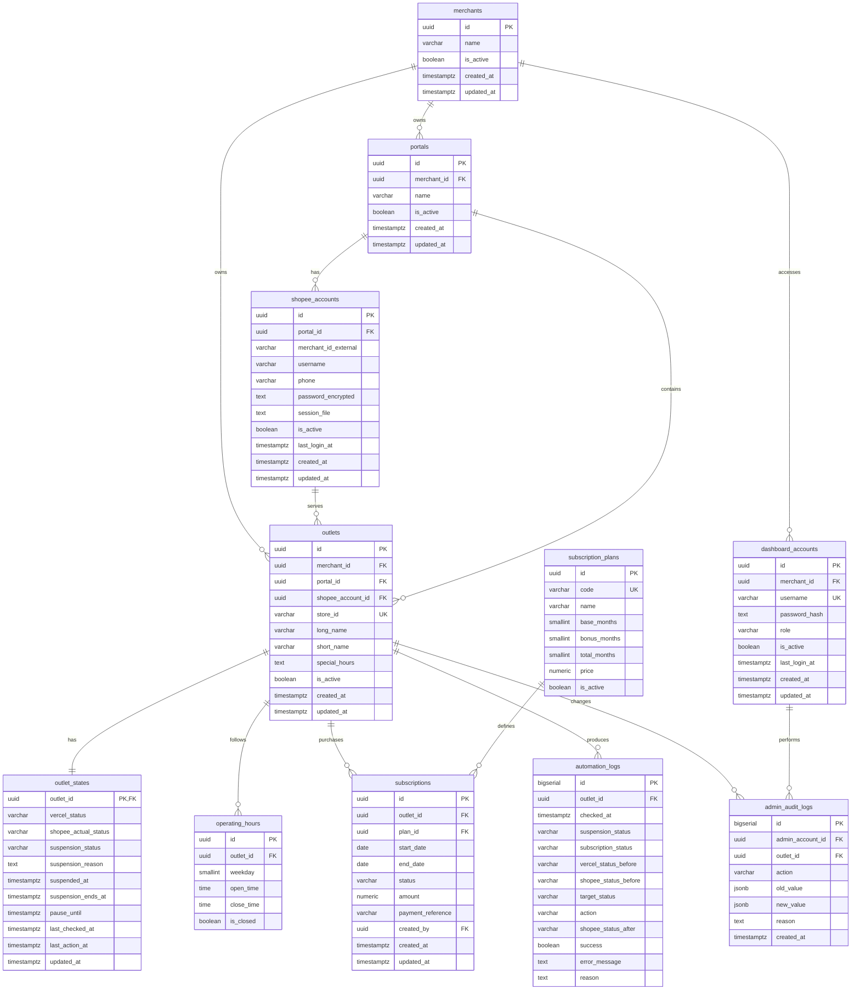

# PostgreSQL Database ERD

## Scope

Skema ini menggantikan Google Spreadsheet dan SQLite sebagai database operasional untuk layanan Auto Open/Auto Close ShopeeFood.

Semua outlet dianggap sebagai outlet ShopeeFood. Kolom `Aplikator` dari spreadsheet tidak dimigrasikan.



## Table responsibilities

### `merchants`

Pemilik atau merchant. Satu merchant dapat memiliki banyak portal dan outlet.

### `portals`

Nama portal pada spreadsheet kolom J. Portal menjadi pengelompokan akun dan outlet merchant.

### `shopee_accounts`

Data akses ShopeePartner dari kolom F-H dan Merchant ID dari kolom K. `password_encrypted` wajib terenkripsi; jangan menyimpan password plaintext.

### `outlets`

Data identitas outlet dari spreadsheet. `store_id` adalah identifier utama yang digunakan worker dan API.

### `operating_hours`

Jadwal kolom R-X. Nilai `weekday` menggunakan standar PostgreSQL:

```text
0 = Minggu
1 = Senin
2 = Selasa
3 = Rabu
4 = Kamis
5 = Jumat
6 = Sabtu
```

### `subscription_plans` dan `subscriptions`

Paket Auto Open dan riwayat pembelian/perpanjangannya.

| Paket | Base | Bonus | Total aktif |
|---|---:|---:|---:|
| 3 bulan | 3 bulan | 0 bulan | 3 bulan |
| 6 bulan | 6 bulan | 1 bulan | 7 bulan |
| 12 bulan | 12 bulan | 4 bulan | 16 bulan |

Subscription expired hanya menonaktifkan Auto Open. Expired tidak otomatis mengubah status penangguhan.

### `outlet_states`

Status operasional terbaru outlet:

- `vercel_status`: source of truth, `ON` atau `OFF`.
- `shopee_actual_status`: status terakhir yang dibaca dari ShopeePartner.
- `suspension_status`: `ACTIVE` atau `SUSPENDED`.
- `pause_until`: batas waktu pause sementara dari dashboard.
- `last_checked_at`: waktu pengecekan terakhir.

Status ini dipisahkan dari `outlets` agar data identitas tidak tercampur dengan status operasional yang sering berubah.

### `dashboard_accounts`

Akun admin dan merchant. Password disimpan sebagai hash. Merchant hanya boleh mengakses outlet dengan `merchant_id` yang sama. Merchant tidak boleh mengubah status penangguhan.

### `automation_logs`

Menyimpan setiap siklus pengecekan bot, keputusan, tindakan, status sebelum dan sesudah tindakan, serta error bila ada.

### `admin_audit_logs`

Mencatat perubahan penting oleh admin, terutama penangguhan, pencabutan penangguhan, perubahan toggle, subscription, dan akun dashboard.

## Spreadsheet mapping A-Y

| Kolom | Header | Target PostgreSQL |
|---|---|---|
| A | Aplikator | Tidak dimigrasikan; semua ShopeeFood |
| B | Kepemilikan | Tidak digunakan; pemisahan VB memakai `vb_brand_outlets` |
| C | Paket | `subscriptions.plan_id` |
| D | Tanggal Mulai Layanan | `subscriptions.start_date` |
| E | Tanggal Berakhir Layanan | `subscriptions.end_date` |
| F | Akses No HP | `shopee_accounts.phone` |
| G | Akses Username | `shopee_accounts.username` |
| H | Akses Kata Sandi | `shopee_accounts.password_encrypted` |
| I | Nama Pemilik | `merchants.name` |
| J | Nama Portal | `portals.name` |
| K | Merchant ID | `shopee_accounts.merchant_id_external` |
| L | Store ID | `outlets.store_id` |
| M | Nama Panjang Outlet | `outlets.long_name` |
| N | Nama Pendek Outlet | `outlets.short_name` |
| O | Status Utama | `outlet_states.vercel_status` |
| P | Vercel Link | `dashboard_accounts` atau konfigurasi deployment |
| Q | Vercel Kata Sandi | `dashboard_accounts.password_hash` |
| R-X | Senin-Minggu | `operating_hours` |
| Y | Jadwal Khusus | `outlets.special_hours` |

Kolom status langganan dan penangguhan di luar A-Y tidak dijadikan sumber utama. Nilainya dikelola oleh PostgreSQL berdasarkan aturan PRD.

## Decision priority

Worker menentukan target outlet menggunakan urutan berikut:

1. `outlet_states.suspension_status`
2. Subscription aktif berdasarkan `subscriptions.end_date`
3. `outlet_states.vercel_status`
4. `operating_hours`
5. `outlet_states.shopee_actual_status`

Jika target berbeda dengan status aktual ShopeePartner, worker menjalankan tindakan `OPEN_STORE` atau `CLOSE_STORE` dan menyimpan hasilnya ke `automation_logs`.

## Constraints

```text
outlets.store_id UNIQUE NOT NULL
operating_hours UNIQUE(outlet_id, weekday)
subscriptions.end_date >= subscriptions.start_date
subscription_plans.total_months = base_months + bonus_months
outlet_states.vercel_status IN ('ON', 'OFF')
outlet_states.suspension_status IN ('ACTIVE', 'SUSPENDED')
dashboard_accounts.role IN ('ADMIN', 'MERCHANT')
```

## Migration principle

Google Spreadsheet digunakan sebagai sumber import awal. Setelah validasi data A-Y selesai, PostgreSQL menjadi source of truth. Spreadsheet tidak lagi dibaca dalam siklus worker.

File OTP tidak termasuk dalam skema ini.
